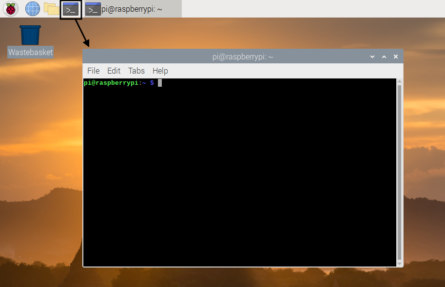

## Your mission

For this project, you will be Pac-Man:

However, instead of just being a hungry yellow circle, you are an ethical hacker and you must defend your computer from nasty viruses. These viruses are the Pac-Man ghosts:

|                                         |        |                                       |       |                                         |        |                                       |       |
|:---------------------------------------:|:------:|:-------------------------------------:|:-----:|:---------------------------------------:|:------:|:-------------------------------------:|:-----:|
|  | Blinky |  | Clyde |  | Spooky |  | Pinky |
|      |  Inky  |  | Funky |        |  Sue   |                                       |       |
|                                         |        |                                       |       |                                         |        |                                       |       |

Your goal is to catch and get rid of all of these ghosts.

Once you have caught all the ghosts, you can collect your treasure.

You can navigate your Raspberry Pi computer by using **the command line**.

\--- task \---

Open a terminal window by clicking on the **Terminal** icon at the top of the screen, or select **Accessories** and then **Terminal** in the menu.

\--- /task \---