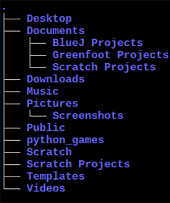

## Move around the Raspberry Pi terminal

### Listing directory content

The `ls` ('list') command lists the files and **directories** (folders) inside the current directory.

\--- task \---

After the shell prompt, type `ls` and press <kbd>Enter</kbd>.

Make sure you type the letter `l` as in "lime" and not the number `1`.

    ls
    

You should see something like this: 

You cannot see any files, because there aren't any, but you can see lots of directories.

\--- /task \---

### Print working directory

The `pwd` command shows your current (working) directory.

You can use this command any time you get lost!

\--- task \---

Type `pwd` and press <kbd>Enter</kbd>.

    pwd
    

This is what you should see (results in the red box): 

**Note:** This directory is your `home` directory. It is where you can save all your files.

Although different users will have different home directories, it will always have the shortcut `~`, as you can see at the start of the shell prompt.

\--- /task \---

The **file system** is the way files and directories on your computer are organised. A computer's file system usually has a tree structure:

|                                         |                                   |
|:---------------------------------------:|:---------------------------------:|
|  |  |

### Change directory

`cd` stands for 'change directory'.

\--- task \---

Type `cd Documents` and press <kbd>Enter</kbd>.

    cd Documents
    

Now you've changed into the `Documents` directory.

\--- /task \---

### Moving between directories

\--- task \---

Type `cd` followed by a space and two full stops `..`, and then pressing <kbd>Enter</kbd>.

    cd ..
    

`cd ..` navigates up from `home/pi/Documents` back to `home/pi`.

You can quickly check you're in the right directory using the `pwd` command:

\--- /task \---