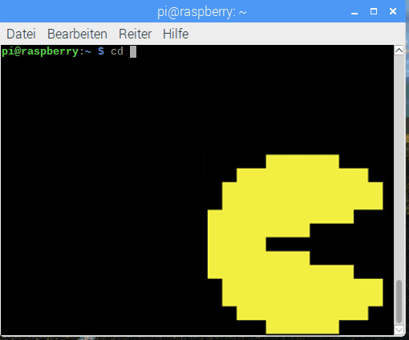

## Einleitung

Hacke das Pi-Terminal und lerne grundlegende Fähigkeiten der Cybersicherheit bei einer Pac-Man Schatzsuche.

### Was du machen wirst

Du wirst die ersten Schritte machen, um ein genialer, moralischer Hacker zu werden! Dieses Projekt führt dich auf eine Reise durch das Terminal deines Pis wobei du lernst, durch das Terminal zu navigieren und deinen Computer vor fiesen Angreifern zu schützen.

Während der Schatzsuche wirst du:

+ Mit deiner Mission vertraut gemacht werden: hacke das Terminal und finde alle Pac-Man-Geister
+ Lernen, wie ein Skript ausgeführt wird, um die Schatzsuche zu beginnen
+ Die Geister finden und sie in Quarantäne bringen, indem du ein eigenes, sicheres Verzeichnis erstellst
+ Mehr über Schadsoftware lernen, indem du die Geisterdateien überprüfst und los wirst
+ Genug Schätze sammeln, um die Schatzsuche erfolgreich abzuschließen

\--- collapse \---

* * *

## title: Was du brauchen wirst

### Hardware

+ Ein Raspberry Pi mit SD-Karte und Peripheriegeräten, die mit dem Internet verbunden sind

### Software

Du brauchst die neueste Version von [Raspbian](https://www.raspberrypi.org/downloads/), die bereits folgende Software enthält:

+ Terminal

\--- /collapse \---

\--- collapse \---

* * *

## title: Was du lernen wirst

Du wirst einige grundlegende Hacking-Methoden kennen lernen und bekommst einen Einblick in Cybersicherheits-Konzepte und Bedrohungen.

Du wirst auch lernen, die folgenden Dinge im Terminal zu machen:

+ Ein Skript herunterladen und ausführen
+ Durch deinen Computer navigieren
+ Ein Verzeichnis erstellen
+ Dateien auf deinem Computer zu kopieren und zu verschieben
+ Dateien löschen
+ Die Software Nano zu nutzen, um Dateien anzuzeigen und wieder zu schließen

Dieses Projekt umfasst Elemente aus den folgenden Teilen des [Raspberry Pi Digital Making Curriculum](https://www.raspberrypi.org/curriculum/):

- [Verwendung elementarer Programmiersprachelemente zur Erstellung einfacher Programme](https://www.raspberrypi.org/curriculum/programming/creator/)

\--- /collapse \---