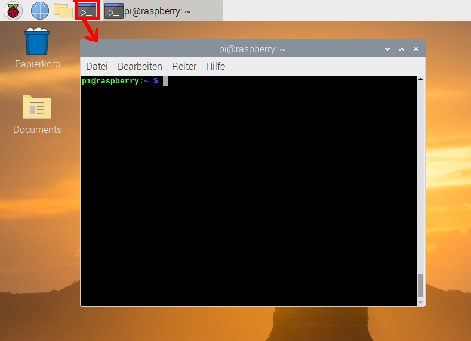

## Deine Mission

In diesem Projekt wirst du Pac-Man sein:

Aber anstatt nur ein hungriger gelber Kreis zu sein, bist du ein ethisch korrekter Hacker und musst deinen Computer vor Angreifern schützen!

Das ist die Situation: Es gibt ein großes Problem mit deinem Computersystem - es wird von bösen Viren angegriffen. Diese Viren sind die Pac-Man-Geister:

|                                             |        |                                           |       |                                             |        |                                           |       |
|:-------------------------------------------:|:------:|:-----------------------------------------:|:-----:|:-------------------------------------------:|:------:|:-----------------------------------------:|:-----:|
|  | Blinky |  | Clyde |  | Spooky |  | Pinky |
|      |  Inky  |  | Funky |        |  Sue   |                                           |       |
|                                             |        |                                           |       |                                             |        |                                           |       |

Dein Ziel ist es, all diese Geister zu fangen und loszuwerden! Sobald Du alle Geister gefangen hast, kannst du deinen Schatz einsammeln.

Um die Geister zu fangen, musst du durch das Labyrinth navigieren, das dein Computer sein wird. Du kannst mithilfe der **Befehlszeile** auf deinem Raspberry Pi navigieren. Die Befehlszeile ist eine Textschnittstelle für deinen Computer, mit der du dem Betriebssystem des Computers Befehle erteilen kannst. Über die Befehlszeile kannst du durch Dateien und Ordner auf deinem Computer navigieren, genau wie du es mit Finder unter macOS oder Explorer unter Windows tun würdest. Der Unterschied besteht darin, dass die Befehlszeile vollständig textbasiert ist! Die Befehlszeile ist ein leistungsfähiges Werkzeug, mit dem du Programme ausführen, Skripte zur Automatisierung von Aufgaben schreiben und einfache Befehle kombinieren kannst, um schwierigere Aufgaben zu bewältigen.

Um die Schatzsuche abzuschließen musst du also:

1. Die Geister finden
2. Die Geister fangen
3. Deinen Schatz einsammeln

\--- task \--- Um auf die Befehlszeile deines Raspberry Pi zuzugreifen, öffnest du ein Terminalfenster, indem du auf das **Terminal** Symbol oben auf dem Bildschirm klickst. Oder du wählst im Startmenü **Zubehör** und dann **Terminal**.

\--- /task \---