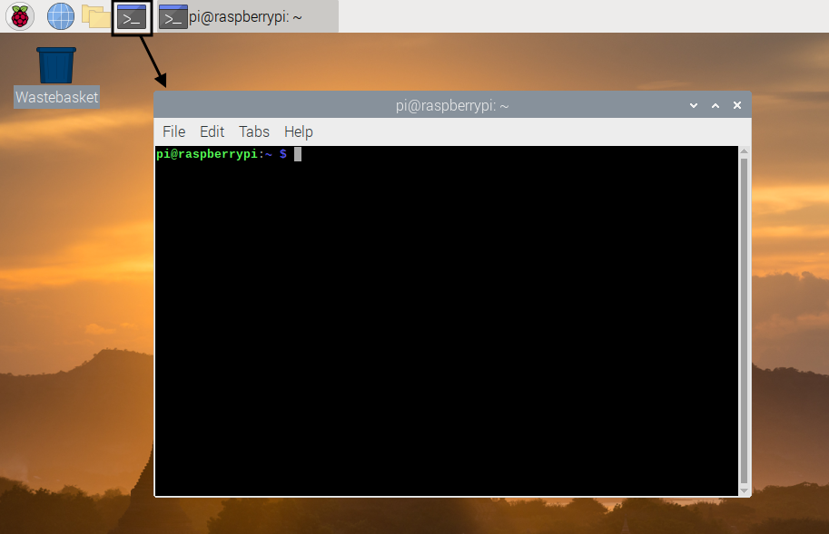

## Deine Mission

In diesem Projekt wirst du Pac-Man sein:

However, instead of just being a hungry yellow circle, you are an ethical hacker and you must defend your computer from nasty viruses. Diese Viren sind die Pac-Man-Geister:

|                                             |        |                                           |       |                                             |        |                                           |       |
|:-------------------------------------------:|:------:|:-----------------------------------------:|:-----:|:-------------------------------------------:|:------:|:-----------------------------------------:|:-----:|
|  | Blinky |  | Clyde |  | Spooky |  | Pinky |
|      |  Inky  |  | Funky |        |  Sue   |                                           |       |
|                                             |        |                                           |       |                                             |        |                                           |       |

Your goal is to catch and get rid of all of these ghosts.

Once you have caught all the ghosts, you can collect your treasure.

Du kannst mithilfe der **Befehlszeile** auf deinem Raspberry Pi navigieren.

\--- task \---

Open a terminal window by clicking on the **Terminal** icon at the top of the screen, or select **Accessories** and then **Terminal** in the menu.

\--- /task \---