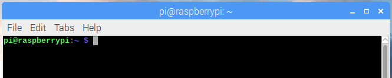

## Beginne die Schatzsuche

Um die Schatzsuche zu starten, musst du eine Datei herunterladen, welche die Pac-Man-Geister frei lässt! Bitte beachte, dass du **keine echten Viren herunterlädst**, wenn du diesen Schritt ausführst. Die Dateien, die du herunterlädst, sind komplett sicher und können deinem Computer keinen Schaden zufügen.

Im Terminal kannst du mit **bash** sehr einfach Dateien oder Skripte herunterladen und öffnen. Bash ist ein Programm, das auf deine Befehle hört und das tut, was du von ihm verlangst. Hacker kümmern sich um Probleme in Computersystemen und Programmen. Daher müssen sie Befehle erteilen, um solche Probleme zu finden und zu beheben. Daher müssen sie gut darin sein, Befehle in Programmen wie bash zu verwenden.

--- task --- Um auf Bash zugreifen zu können, musst du ein Terminalfenster geöffnet haben.

Im Terminal wird `$` angezeigt. Dies wird als **Shell-Eingabeaufforderung** (oder english: prompt) bezeichnet. Es wird angezeigt, wenn das Terminal bereit ist, einen Befehl anzunehmen.

Tippe den folgenden Befehl neben dem `$` (die Shell-Eingabeaufforderung) ein oder kopiere ihn und füge ihn anschließend ein:

    wget -O - http://rpf.io/pacmanstart | bash
    

--- /task ---

--- task --- Drücke die <kbd>Eingabetaste</kbd>, um diese Codezeile auszuführen. Im Terminal wird anschließend viel Text angezeigt. Das bedeutet, dass die Dateien heruntergeladen werden, um die Schatzsuche zu beginnen.

**Hinweis:** der `| bash` Befehl am Ende weist bash an, die Datei nach dem Herunterladen automatisch auszuführen. Die Verwendung dieses Befehls ist generell nicht sehr sicher, da die heruntergeladenen Dateien ausgeführt werden, ohne dass du sie zuerst überprüfen kannst. Dennoch ist es hier der einfachste Weg, um die Schatzsuche zu beginnen. Und du siehst wie einfach es ist, Viren herunterzuladen. --- /task ---

--- task --- Drücke <kbd>Strg l</kbd> um den Inhalt des Terminalfensters zu löschen. --- /task ---

Als Nächstes lernst du, wie du in der Befehlszeile navigieren kannst, um die Geister zu finden und zu fangen.