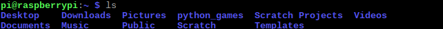

## Bewege dich im Pi-Terminal

In diesem Schritt lernst du, wie du Pac-Man durch das Pi-Terminal navigierst, genau wie Pac-Man sich in seinem Labyrinth bewegt.


### Verzeichnisinhalte auflisten

Der `ls` Befehl durchsucht den Ordner, in dem du dich befindest, und listet dann die Dateien und **Verzeichnisse** darin auf (`ls` steht für 'list', engl.: auflisten). Wenn du das Terminal verwendest, werden Ordner als Verzeichnisse bezeichnet.

--- task --- Gib nach der Shell-Eingabeaufforderung `ls` ein und drücke die <kbd>Eingabetaste</kbd>. Stelle dabei sicher, dass du den Buchstaben `l` wie in "leben" eingibst und nicht die Zahl `1`.
```
    ls
```    

Du solltest ein ähnliches Ergebnis wie dieses erhalten: 

Hier kannst du keine Dateien sehen, da es keine gibt, aber du kannst viele Verzeichnisse sehen.

Das Verzeichnis oder der Ordner, in dem du dich befindest, enthält daher die folgenden Verzeichnisse: `Desktop`, `Downloads`, `Pictures`, `python_games`, `Scratch Projects`, `Videos`, `Documents`, `Music`, `Public`, `Scratch` und `Templates` --- /task ---

### Arbeitsverzeichnis ausgeben

`pwd` steht für "print working directory" (das ist englisch und heißt: "gib das Arbeitsverzeichnis aus"). Dieser Befehl zeigt an, wo du dich im **Dateisystem** des Pi's befindest. Das heißt, er sagt dir, in welchem Verzeichnis du gerade in der Befehlszeile bist - dein Arbeitsverzeichnis! Du kannst diesen Befehl jederzeit benutzen um dich zu orientieren.

--- task --- Gebe `pwd` ein und drücke die <kbd>Eingabetaste</kbd>.
```
    pwd
```    

Du solltest folgendes Ergebnis bekommen (in der roten Box): 


Hier kannst du sehen, dass du dich im Verzeichnis `/home/pi` befindest. Das bedeutet, dass du dich im `pi` Verzeichnis befindest, welches wiederum im `home` Verzeichnis gespeichert ist. (Die `/` Symbole sind nicht Teil der Verzeichnisnamen, die Befehlszeile nutzt sie nur um dir Verzeichnisse anzuzeigen.)

**Hinweis:**

Dieses Verzeichnis ist dein *home* Verzeichnis (also dein "Heimat-Ordner"). Dort kannst du alle deine Dateien speichern.

Wenn du einen anderen Benutzernamen als `pi` verwendest, wird dein *home* Verzeichnis ein anderes Verzeichnis haben, aber es wird immer die Abkürzung `~` haben, wie du am Anfang der Shell-Eingabeaufforderung sehen kannst.


--- /task ---

Das **Dateisystem** ist die Art und Weise, wie Dateien und Verzeichnisse auf deinem Computer organisiert sind. Das Dateisystem eines Computers hat normalerweise eine Baumstruktur:

|                                              |                                              |
| :------------------------------------------: | :------------------------------------------: |
|       |             |


### Ändere das Verzeichnis

`cd` steht für "change directory" (englisch für "Verzeichnis wechseln"). So wie du auf einen Ordnersymbol in einem grafischen Dateimanager klickst, um den Ordner zu öffnen, kannst du mit `cd` den genannten Ordner öffnen. Um in ein Verzeichnis zu gelangen, gibst du einfach den Befehl `cd` ein, gefolgt von einem Leerzeichen, dem Namen des Verzeichnisses und einem Schrägstrich `/`.

--- task --- Versuche, in ein anderes Verzeichnis zu wechseln, tippe dazu `cd Documents/` ein und drücke die <kbd>Eingabetaste</kbd>.
```
    cd Documents/
```    


Jetzt bist du in das `Dokumente` Verzeichnis gelangt!

Das Terminal teilt dir hier mit, dass du dich in `Documents` befindest:

 --- /task ---

### Zwischen Verzeichnissen wechseln

--- task --- Du kannst ein Verzeichnis im Dateisystem nach oben gehen (oder zurück, je nachdem, wie du es dir vorstellen möchtest), indem du `cd` eingibst, gefolgt von einem Leerzeichen und zwei Punkten `..` und dann die <kbd>Eingabetaste</kbd> drückst.
```
    cd ..
```    

`cd ..` bringt dich von `home/pi/Documents` nach oben zu `home/pi` zurück.

Mit dem `pwd` Befehl kannst du schnell überprüfen, ob du dich im richtigen Verzeichnis befindest:

 --- /task ---

Jetzt bist du bereit, deinen ersten Geist zu fangen!