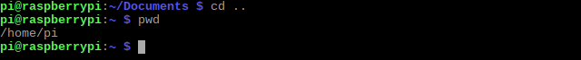

## Move around the Raspberry Pi terminal

### Verzeichnisinhalte auflisten

The `ls` ('list') command lists the files and **directories** (folders) inside the current directory.

\--- task \--- Gib nach der Shell-Eingabeaufforderung `ls` ein und drücke die <kbd>Eingabetaste</kbd>.

Stelle dabei sicher, dass du den Buchstaben `l` wie in "leben" eingibst und nicht die Zahl `1`.

    ls
    

You should see something like this: 

You cannot see any files, because there aren't any, but you can see lots of directories.

\--- /task \---

### Arbeitsverzeichnis ausgeben

The `pwd` command shows your current (working) directory.

You can use this command any time you get lost!

\--- task \--- Gib `pwd` ein und drücke die <kbd>Eingabetaste</kbd>.

    pwd
    

This is what you should see (results in the red box): 

**Note:** This directory is your `home` directory. It is where you can save all your files.

Although different users will have different home directories, it will always have the shortcut `~`, as you can see at the start of the shell prompt.

\--- /task \---

Das **Dateisystem** ist die Art und Weise, wie Dateien und Verzeichnisse auf deinem Computer organisiert sind. Das Dateisystem eines Computers hat normalerweise eine Baumstruktur:

|                                         |                                   |
|:---------------------------------------:|:---------------------------------:|
|  |  |

### Ändere das Verzeichnis

`cd` steht für 'change directory' (Englisch für 'Verzeichnis wechseln').

\--- task \--- Type `cd Documents` and press <kbd>Enter</kbd>.

    cd Documents
    

Now you've changed into the `Documents` directory.

 \--- /task \---

### Zwischen Verzeichnissen wechseln

\--- task \--- Type `cd` followed by a space and two full stops `..`, and then pressing <kbd>Enter</kbd>.

    cd ..
    

`cd ..` bringt dich von `home/pi/Documents` nach oben zu `home/pi` zurück.

Mit dem `pwd` Befehl kannst du schnell überprüfen, ob du dich im richtigen Verzeichnis befindest:

 \--- /task \---