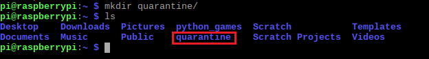

## Fange deinen ersten Geist und bringe ihn in Quarantäne

In diesem Schritt erstellst du einen **Quarantäneordner** um deine Geister dort hinein zu stecken. Danach wirst du alle Geister fangen und in diesen Ordner verbannen, damit sie nicht mehr herum geistern und deinem Computer schaden können, wie es Viren tun.

In einem Quarantäneordner werden verdächtige Dateien isoliert, damit sie deinem Computer keinen Schaden zufügen können. Diese werden in der Regel automatisch von Antivirensoftware erstellt und mit zusätzlicher Programmierung versehen - du wirst simulieren, wie es ist so einen selbst zu erstellen.

Zuerst lernst du, deine eigenen Verzeichnisse in deinem Dateisystem zu erstellen!

--- task --- Lege neben der Shell-Eingabeaufforderung einen Quarantäneordner an, indem du `mkdir Quarantäne/` eingibst. Drücke anschließend die <kbd>Eingabetaste</kbd>.

    mkdir quarantine/
    

`mkdir` steht für "make directory" (englisch für "erstelle Verzeichnis"). Der von dir eingegebene Befehl hat ein neues Verzeichnis mit dem Namen `quarantine (engl. für Quarantäne)` in deinem *home* Verzeichnis erstellt. Auf dem Bild kannst du sehen, dass ich auch den `ls` Befehl verwendet habe, um zu überprüfen, ob mein Verzeichnis existiert:

 --- /task ---

### Fangen wir unseren ersten Geist!

--- task --- Navigiere in das `Documents` Verzeichnis mit den Befehlen, die du im letzten Schritt gelernt hast.

--- hints ---
 --- hint --- Gib dies in dein Terminalfenster ein:

    cd Documents/
    

--- /hint --- --- hint --- Falls das nicht geklappt hat, tippe zuerst `cd` ein, um zu deinem home Verzeichnis zu navigieren, und versuche dann `cd Documents/`.

    cd
    cd Documents/
    

--- /hint ------ /hints --- --- /task ---

--- task --- Liste alle Dateien und Verzeichnisse im `Documents` Verzeichnis auf, indem du den Befehl benutzt, den du im letzten Schritt gelernt hast.

--- hints ---
 --- hint --- Kannst du herausfinden, welchen Befehl du aus den Dropdown-Informationsfeldern oben verwenden solltest?
--- /hint ---
 --- hint --- Verwende:

    ls
    

--- /hint ------ /hints --- --- /task ---

--- task --- Sieh dir die Verzeichnisse an. Siehst du etwas Seltsames, das den Eindruck hinterlässt, es sollte eigentlich nicht da sein?

--- collapse ---
---
title: Klicke hier, wenn du deinen ersten Geist gefunden hast!
---

Diese seltsame Datei mit dem Namen `sp00ky.txt` ist ein Virus. Wenn du sie entdeckt hast, hast du deinen ersten Geist gefunden!

Du hast Spooky gefunden! 

Vielleicht hast du bemerkt, dass der Virus `sp00ky.txt` genannt wurde, statt `spooky.txt`. Sowohl ethische korrekte als auch nicht ganz so ethische Hacker ersetzen bestimmte Buchstaben durch Zahlen, sodass sie bei der einfachen Suche nach Stichwörtern nicht so leicht gefunden werden können. Denke daran, wenn du nach den anderen Geistern suchst. --- /collapse --- --- /task ---

### Dateien kopieren

--- task --- Kopiere den Geist und lege ihn in den Quarantäneordner, indem du Folgendes eingibst:

    cp sp00ky.txt ~/quarantine/
    

`cp` (für 'copy', englisch für "kopiere") wird gefolgt vom Namen der zu kopierenden Datei und dem Verzeichnis, in das sie kopiert werden soll. Hier haben wir die Datei `sp00ky.txt` kopiert und in den `Quarantäne` Ordner im *home* Verzeichnis (`~`) gelegt. --- /task ---

### Dateien entfernen

--- task --- Entferne nun den Geist, indem du Folgendes eingibst:

    rm sp00ky.txt
    

`rm` steht für "remove" (englisch für "entfernen") und löscht Dateien (und Verzeichnisse). Hier hast du die Datei `sp00ky.txt` aus dem Ordner, in dem du sie gefunden hast, entfernt, um sie davon abzuhalten, Schaden anzurichten. --- /task ---

**Hinweis:** Sei vorsichtig bei der Verwendung von `rm`. Damit werden Dinge dauerhaft von deinem Computer gelöscht! Es gibt keinen Befehl, der das Löschen rückgängig macht, wenn du also etwas mit `rm` löschst, ist es für immer verschwunden. Aus diesem Grund haben wir die Datei in ein neues Verzeichnis kopiert, bevor wir sie gelöscht haben.

Du bist jetzt bereit, sicher alle Geister zu fangen!