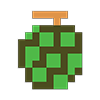
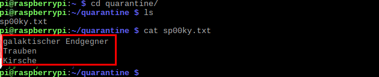

## Finde den Schatz

Nachdem du alle Geister gefunden und in einem sicheren Ordner abgelegt hast, damit sie deinen Computer nicht beschädigen, wirst du die Dateien durchsuchen, um deinen Schatz zu sammeln.

Hier findest du alle Schätze, die du sammeln kannst und die Punkte, die du für jeden erhältst:

|                       Schatz                        |                        | Punkte |
|:---------------------------------------------------:|:----------------------:|:------:|
|                   |        Kirsche         |  100   |
|              |        Erdbeere        |  300   |
|                   |        Pfirsich        |  500   |
|                      |         Apfel          |  700   |
|                   |        Trauben         |  1000  |
|  | Galaktischer Endgegner |  2000  |
|                      |         Glocke         |  3000  |
|                    |       Schlüssel        |  5000  |

\--- task \--- Navigiere zu deinem `Quarantäne/` Verzeichnis und liste dann den Inhalt des Verzeichnisses auf, um alle gefangenen Geister anzuzeigen.

\--- Hinweise \--- \--- Hinweis \--- Verwende den `cd` Befehl gefolgt vom Namen des Verzeichnisses, anschließend den `ls` Befehl. \--- /hint \--- \--- hint \---

    cd quarantine/
    ls
    

\--- /hint \--- \--- /hints \--- \--- /task \---

### Sammle deinen Schatz

\--- task \--- Schau welchen Schatz du durch das Fangen von Spooky bekommen hast!

Um eine Textdatei anzusehen, tippe `cat` gefolgt vom vollständigen Namen der Datei im Terminalfenster ein und drücke die <kbd>Eingabetaste</kbd>:

    cat sp00ky.txt
    

\--- /task \---

\--- task \--- Du solltest einige Schätze sehen können.

 \--- /task \---

\--- task \--- Klicke im Scratch-Programm unten auf die Schätze, die du in `sp00ky.txt` gefunden hast, um deine Punkte zu zählen, und wiederhole dann diese letzten drei Anweisungen um die Schätze von all deinen Geisterdateien zu sammeln.

Wenn du alle Schätze angeklickt hast, die du gefunden hast, klicke auf den **Finish** Knopf, um zu sehen, wie du abgeschnitten hast. \--- /task \---

<iframe allowtransparency="true" width="485" height="402" src="//scratch.mit.edu/projects/embed/226468273/?autostart=false" frameborder="0" allowfullscreen mark="crwd-mark"></iframe>

