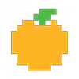
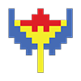

## Finde den Schatz

Now that you have found and quarantined all the ghosts, you need to check the files to collect your treasure.

Hier findest du alle Schätze, die du sammeln kannst und die Punkte, die du für jeden erhältst:

|                       Schatz                        |                        | Punkte |
|:---------------------------------------------------:|:----------------------:|:------:|
|                   |        Kirsche         |  100   |
|              |        Erdbeere        |  300   |
|                   |        Pfirsich        |  500   |
|                      |         Apfel          |  700   |
|                   |        Trauben         |  1000  |
|  | Galaktischer Endgegner |  2000  |
|                      |         Glocke         |  3000  |
|                    |       Schlüssel        |  5000  |

\--- task \--- Navigate to your `quarantine/` directory and list the contents of the directory to see all the ghosts you have caught.

    cd quarantine/
    ls
    

\--- /task \---

### Sammle deinen Schatz

See what treasure you got from catching Spooky!

\--- task \---

To view a text file, type `cat` followed by the full name of the file and then press <kbd>Enter</kbd>:

    cat sp00ky.txt
    

\--- /task \---

You should see some treasure.

\--- task \--- In the Scratch program at the end of this step, click on the treasure you've found inside `sp00ky.txt` to add up your points.

**Don't click 'Finish' yet**.

\--- /task \---

\--- task \---

View the treasure inside the other ghost files you caught and click it in the Scratch program.

Wenn du alle Schätze angeklickt hast, die du gefunden hast, klicke auf den **Finish** Knopf, um zu sehen, wie du abgeschnitten hast. \--- /task \---

<iframe allowtransparency="true" width="485" height="402" src="//scratch.mit.edu/projects/embed/226468273/?autostart=false" frameborder="0" allowfullscreen></iframe>

