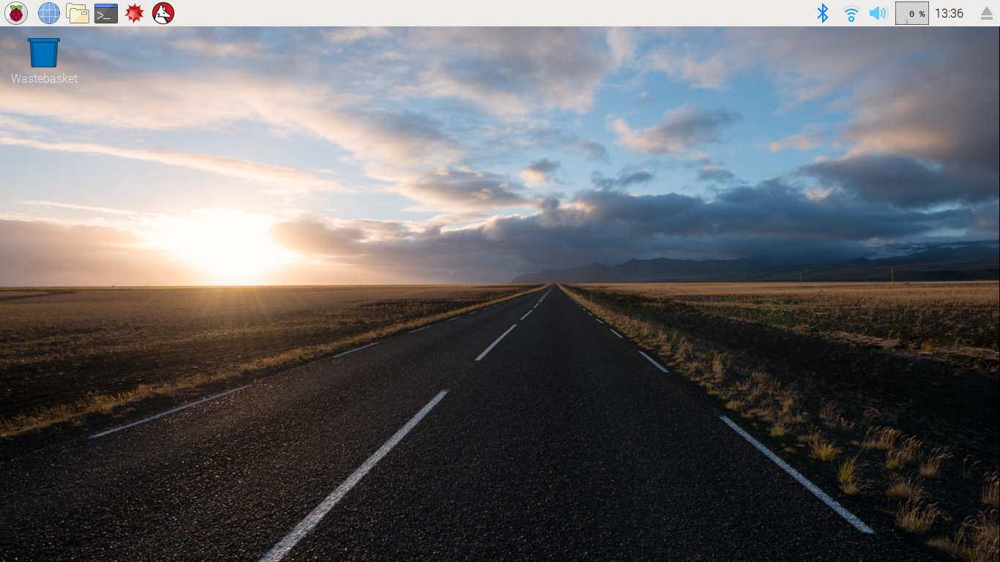

## Your mission

For this project, you will be Pacman:

However, instead of just being a hungry yellow circle, you are an ethical hacker and you must defend your computer from nasty attackers.

There is a huge problem with your computer system. It is being attacked by nasty viruses. These viruses are the Pacman ghosts:

|                                              |                                              |
| :------------------------------------------: | :------------------------------------------: |
|       | Blinky                                       |
|           | Inky                                         |
|         | Pinky                                        |
|         | Clyde                                        |
|         | Funky                                        |
|       | Spooky                                       |
|             | Sue                                          |

Your goal is to catch and get rid of all of these ghosts.

To catch these ghosts, you will need to navigate the maze that is your computer. You can navigate your Raspberry Pi computer by using **the command line**. The command line is a text interface for your computer that gives command to the computer's operating system. From the command line, you can navigate through files and folders on your computer, just as you would with Finder on Mac OS or Windows Explorer on Windows. The difference is that the command line is fully text-based. The command line is a powerful tool, and with it you can run programs, write scripts to automate tasks, and combine simple commands to handle more difficult tasks.

INGREDIENT - INCLUDE ALL COMMANDS? AND SOMETHING TO USE IN DOCUMENTING YOUR CODE RESOURCE.

Once you have caught all the ghosts, you can go about collecting your treasure.

So, to complete the treasure hunt you must:

1. Find the ghosts
2. Trap the ghosts
3. Collect your treasure

+ Open a terminal window on the Raspberry Pi to access the command line. You can find the terminal here:

