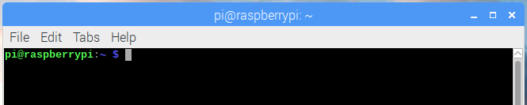

## Start the treasure hunt

To start the treasure hunt, you will need to download a file that will unleash the Pacman ghosts.

You can easily download anything and open it via the terminal using **bash**. Bash is a program that listens to your commands and does what you tell it to do. Hackers are concerned with problems in computer systems and programs, and they need to give commands to find these problems and fix them. Therefore, they need to be good at using commands in programs like bash.

Please note that you are not downloading real viruses by completing this step. The files you download will not do any damage to your computer.

+ To access bash, make sure you have opened a terminal window.

  In the terminal, you will see `$`. This is called a **shell prompt**. It appears when the terminal is ready to accept a command.

  

+ Next to the `$` (the shell prompt), type or copy and paste:
  ```
  wget -O - http://rpf.io/pacmanstart | bash
  ```
+ Press the <kbd>Enter</kbd> key to run this line of code. You will see a lot of text appear in the terminal. This means it is downloading the files to start the treasure hunt.
  
  **Note:** the `| bash` command at the end automatically runs the file you're downloading. Using this command is generally not very secure because it means your computer will run the downloaded files without you checking them first. However, here it is the easiest way to start the treasure hunt and shows you how easy it is to download viruses.

+ Press <kbd>Ctrl l</kbd> to clear the terminal window.

Next you'll learn how to navigate the command line so you can start finding and catching ghosts.
