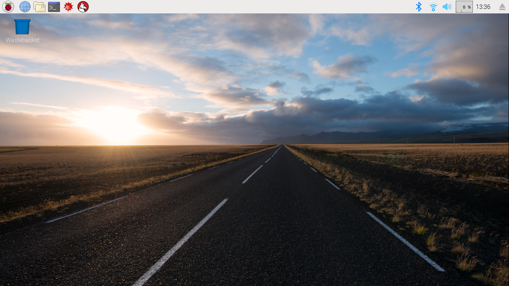

## Start the treasure hunt

To start the treasure hunt, you will need to download a file from the internet which will unleash the Pacman Ghosts.

You can easily download anything and open it from the terminal in **Bash**. Bash is a scripting language that is used in ...
Hackers use it all the time to ...

+ Open a terminal window on the Raspberry Pi. You can find the terminal here:

+ Type this command into the terminal:

wget -O - http://.../pacman_start.sh | bash

