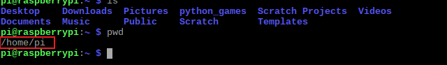

## Move around the Pi terminal

In this step, you will learn how to get Pacman to navigate the Pi's terminal, just like when Pacman moves around his maze.


### Listing directory content

The `ls` command looks at the folder you are in and then lists the files and **directories** inside it (`ls` stands for 'list'). When you're using the terminal, folders are called directories.

+ After the shell prompt, type `ls` and press <kbd>Enter</kbd>. Make sure you type the letter `l` as in "lime" and not the number `1`.
  ```
  ls
  ```
  You should get a similar result to this:
  

  Here, you cannot see any files, because there aren't any, but you can see lots of directories.

  The directory, or folder you are in, therefore contains these directories:
  `Desktop`, `Downloads`, `Pictures`, `python_games`, `Scratch Projects`, `Videos`, `Documents`, `Music`, `Public`, `Scratch`, and `Templates`


### Print working directory

`pwd` stands for 'print working directory'. This command shows where you are in the Pi's **file system**, meaning it tells you what directory you are currently in in the command line so you don't get lost.

+ Type `pwd` and press <kbd>Enter</kbd>.
  ```
  pwd
  ```
  This is what you should get (results in the red box):
  

  Here you can see that you are in the `/home/pi/` directory. This means you're inside the `pi` directory, which itself is stored inside the `home` directory.

  The file system is the way files and directories on your computer are organised. A file system usually organises a computer's files and directories into a tree structure:

  |                                              |                                              |
  | :------------------------------------------: | :------------------------------------------: |
  |       |             |


### Changing directory

`cd` stands for 'change directory'. Just the same as you can click on a folder icon in a graphic file manager to go into it, `cd` lets you go into the directory you tell it. To get into a directory, just type the command `cd` followed by the name of the directory and a forward slash `/`. The `/` isn't part of the directory name, it is just the way the command line shows directories.

+ To try moving into a different directory, type `cd Documents/` and press <kbd>Enter</kbd>.
  ```
  cd Documents/
  ```
  

  Now you've navigated into the `Documents` directory!

  The terminal tells you here that you are in `Documents`:

  


### Moving between directories

+ Move up (or back, depending on how you want to imagine it) one directory by typing `cd ..` and pressing <kbd>Enter</kbd>.
  ```
  cd ..
  ```
  `cd ..` navigates up from `home/pi/Documents` back to `home/pi/`.

  You can quickly check you're in the right directory using the `pwd` command:

  

Now you're ready to catch your first ghost!
