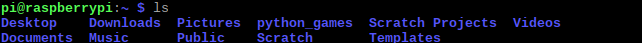
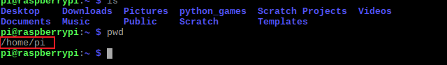
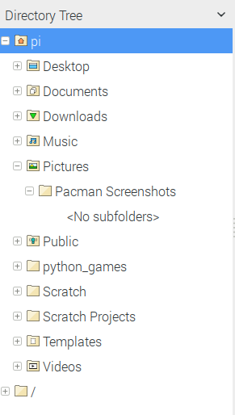
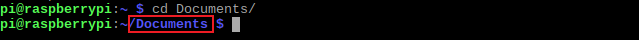

## Move around the pi terminal

In this step, we will learn how to get Pacman to navigate the pi terminal, just like when Pacman moves around the maze.

### Listing Directory Content (`ls`)

+ After the shell prompt, type `ls` and press enter. Make sure you type the letter l as in "lime" and not the number 1.

You should get a similar result to this:

When you type `ls`, the command line looks at the folder you are in, and then "lists" the files and **directories**, or folders, inside it. Here, we cannot see any files, because there are none at this level, but we can see lots of directories.

When using the command line, we refer to folders as directories. These are all folders that you can navigate to. The contents of the current directory are therefore these directories:
Desktop, Downloads, Pictures, python_games, Scratch Projects, Videos, Documents, Music, Public, Scratch, and Templates

### Print Working Directory (`pwd`)

+ Now, type `pwd` and press enter.

This is what you should get (results in the red box):

`pwd` stands for "print working directory". It tells you what directory you are currently in, so you will not get lost. The `pwd` command is useful because it shows where you are in the Pi's **filesystem**. We are currently in the `pi/` directory.

The filesystem is how files and directories on your computer are organised. A filesystem usually organises a computer's files and directories into a tree structure:

IMAGE OF FILE SYSTEM 

The very first directory in the filesystem is the **root** directory. It is the parent directory of all other directories in the filesystem.
Each parent directory can contain more child directories and files. Here `home/` is the parent of `pi/` and `pi/` is the parent of all the directories we listed above.

### Changing Directory (`cd`)

+ To move into a different directory, type `cd Documents/` and press enter.

`cd` stands for stands for "change directory". Just as you can click on folders and go into them, `cd` lets you into the directory you want to go into.

The directory we changed into is `Documents/`. To navigate to a directory, you therefore type the command `cd` followed by the name of the directory. So here, `cd Documents/` navigated directly to the `Documents/` directory, and you can see what directory you are in here:

### Moving Directory (`cd ..`)

+ To move up (or back) one directory, type `cd ..` and press enter.

Here, `cd ..` navigates up from `home/pi/documents` back to `home/pi/`.

In the image below, you can see that I have also checked my directory by using the `pwd` command:

Now, you're ready to catch your first ghost!
