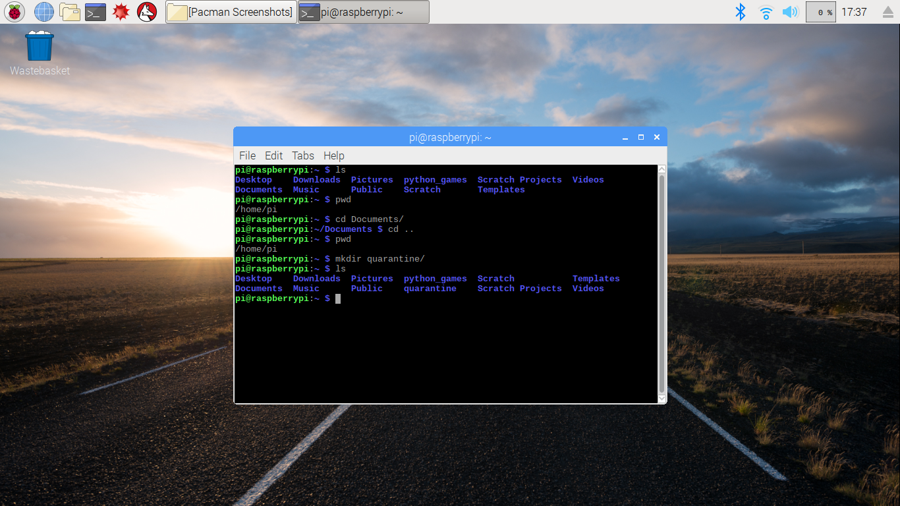

## Catch and quarantine your first ghost

In this step, you will create a quarantine folder to put your ghosts in. You will then catch all of the ghosts and quarantine them so that they stop ghosting around and harming your computer like viruses do.

A **quarantine folder** isolates suspicious files so they cannot harm your computer. They are usually made automatically through Antivirus software and have additional programming attached to them, however you will simulate what it is like to create one.

You can also use what you learn here to create your own directories in your filesystem!

+ After the shell prompt, create a quarantine folder by typing `mkdir quarantine/` and pressing enter.
  ```
  mkdir quarantine/
  ```

  `mkdir` stands for "make directory". We used `mkdir` to create a new directory called **quarantine/** inside the **pi/** directory. In the image, you can see that I have also checked my directory exists by using `ls`:

  


### We are now going to catch our first ghost!

+ Navigate into the **Documents/** directory using the commands you learned in the last step.

  --- hints ---
  --- hint ---
  Type this into your terminal:
  ```
  cd Documents/
  ```
  --- /hint ---
  --- hint ---
  If that did not work, type `cd` first to navigate into your home directory, then try `cd Documents/`
  ```
  cd
  cd Documents/
  ```
  --- /hint ---
  --- /hints ---

+ List all the files and directories in the **Documents/** directory using the commands you learned in the last step.

  --- hints ---
  --- hint ---
  Can you find out which command you would use in the dropdown information from the step above?
  --- /hint ---
  --- hint ---
  Use:
  ```
  ls
  ```
  --- /hint ---
  --- /hints ---

+ Look at the directories. Do you see anything strange that looks like it should not be there?

  --- collapse ---
  ---
  title: Click here when you've found your first ghost!
  ---
  That strange file named `sp00ky.txt` is a virus. If you've spotted it, you have found the ghost.

  You've found Spooky!
  

  You might have noticed that instead of being called `spooky.txt` the virus is called `sp00ky.txt`. Hackers, both ethical and not so ethical, replace certain letters with numbers so they cannot be picked up in simple keyword searches. Keep that in mind when you are looking for the other ghosts.
  --- /collapse ---


### Copying files

+ Copy the ghost and put it in the quarantine folder by typing:
  ```
  cp sp00ky.txt home/pi/Documents/quarantine/
  ```
  `cp` is followed by the name of the file to copy and then the directory you want it copied into. Here, we copied the file **sp00ky.txt** and placed it in the **quarantine/** folder.


### Removing Files

+ Now remove the ghost by typing:
  ```
  rm sp00ky.txt
  ```
  `rm` deletes files and directories. Here we have removed **sp00ky.txt** from the filesystem to stop it from doing damage.

  Be careful using `rm` because it deletes files and directories permanently. There isn't an undelete command, so once you delete a file or directory with `rm`, it's gone. This is why we copied the file into a new directory before removing it.

You're now ready to safely catch all the ghosts.
