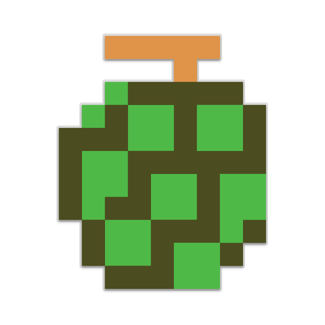

## Find the treasure

Now that you have found all the ghosts and put them in a safe folder so they cannot damage your computer, you will look inside the files to collect your treasure.

Here is all the treasure you can collect and the points you get when you find the treasure:

| Treasure                                     |                                              | Points                                       |
| :------------------------------------------: | :------------------------------------------: | :------------------------------------------: |
|             | Cherry                                       | 100                                          |
|     | Strawberry                                   | 300                                          |
|               | Peach                                        | 500                                          |
|               | Apple                                        | 700                                          |
|             | Grapes                                       | 1000                                         |
|    | Galaxian Boss                                | 2000                                         |
|                 | Bell                                         | 3000                                         |
|                   | Key                                          | 5000                                         |

+ Navigate to your `quarantine/` directory, and then list the contents of the directory to see all the ghosts you have caught.

  --- hints ---
  --- hint ---
  Use the `cd` command followed by the name of the directory, then use the `ls` command.
  --- /hint ---
  --- hint ---
  ```
  cd quarantine/
  ls
  ```
  --- /hint ---
  --- /hints ---

### Collect your treasure

+ See what treasure you got from catching Spooky!

  To view a text file, type `cat` followed by the full name of the file into the terminal window, and then press <kbd>Enter</kbd>:
  ```
  cat sp00ky.txt
  ```

+ You should see some treasure.

  

+ In the Scratch program below, click on the treasure you've found inside `sp00ky.txt` to tally up your points, and then repeat these last three instructions to collect treasure from all of your ghost files.

  When you've finished clicking all the treasure you have found, click the **Finish** button to see how you did.

<div class="scratch-preview">
<iframe allowtransparency="true" width="485" height="402" src="//scratch.mit.edu/projects/embed/226468273/?autostart=false" frameborder="0" allowfullscreen></iframe>
</div>
